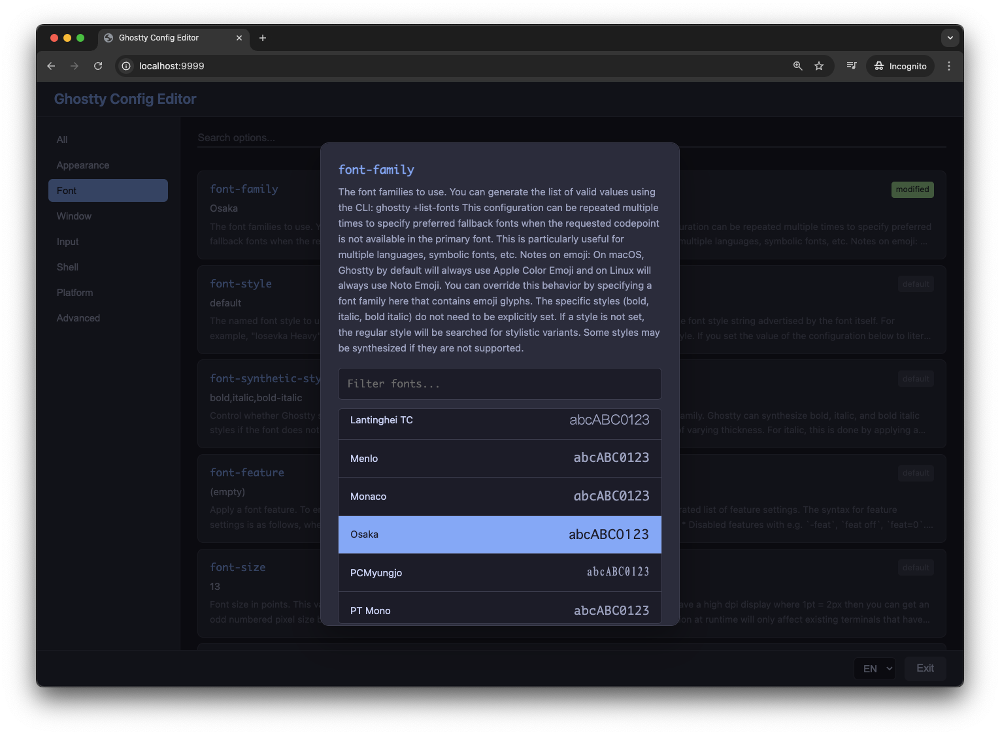

# Ghostty Config Editor

A TUI/GUI editor for [Ghostty](https://ghostty.org/) terminal configuration.



## Requirements

- [Ghostty](https://ghostty.org/) installed and available in PATH

## Install

```sh
go install github.com/otiai10/ghostconfig@latest
# then
ghostconfig -h
```

## Usage

```sh
# GUI mode (default, opens in browser)
ghostconfig

# TUI mode (terminal interface)
ghostconfig -tui

# Custom config file
ghostconfig -file=/path/to/custom/config
```

## Features

- Browse all Ghostty configuration options by category
- Search options by name or description
- Color picker for color options
- Font picker with preview
- Multi-language support (EN/JA)
